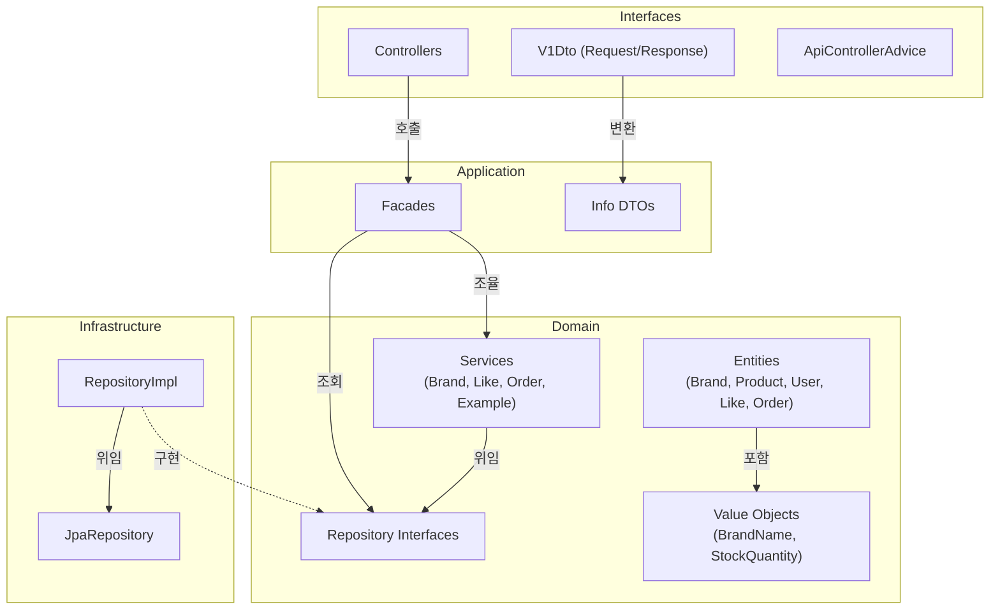

# Commerce API - 아키텍처 문서

## 프로젝트 개요

Spring Boot 기반의 멀티모듈 커머스 플랫폼으로, Layered Architecture + DIP를 적용한 4계층 구조를 채택했다. Domain 계층이 어떤 외부 계층에도 의존하지 않도록 설계했으며, 비즈니스 규칙은 Entity 내부에, 유스케이스 조합은 Application 계층의 Facade에서 담당한다. 현재 Brand, Product, User, Like, Order 5개 도메인이 구현되어 있다.

---

## 4계층 구조

```
Interfaces (API)  →  Application (Facade)  →  Domain (Entity/Service/Repository IF)
                                                        ↑
                                              Infrastructure (Repository Impl)
```

| 계층 | 패키지 | 역할 |
|---|---|---|
| **Interfaces** | `interfaces.api` | HTTP 요청/응답 처리, DTO 변환 |
| **Application** | `application` | 여러 도메인 서비스 조합, 유스케이스 조율 |
| **Domain** | `domain` | 핵심 비즈니스 규칙, Entity, VO, Repository 인터페이스 |
| **Infrastructure** | `infrastructure` | Repository 구현체, JPA 연동 |
| **Support** | `support.error` | 공통 예외 처리 (모든 계층에서 참조 가능) |

---

## 레이어별 책임

### Interfaces Layer

Controller는 요청을 받아 Facade에 위임하고, 응답 DTO로 변환하여 반환한다. 비즈니스 로직을 포함하지 않는다.

- `ApiResponse<T>`: 공통 응답 래퍼 (SUCCESS/FAIL + data)
- `ApiControllerAdvice`: 전역 예외 처리 (CoreException, Validation, 404 등)
- `{Domain}V1Controller`: REST 엔드포인트 (Facade 호출 → DTO 변환)
- `{Domain}V1Dto`: 요청/응답 DTO (record, Jakarta Validation 적용)

### Application Layer

여러 도메인 서비스를 조합하여 하나의 유스케이스를 완성한다. 도메인 로직을 직접 구현하지 않고 위임만 한다.

- `{Domain}Facade`: 유스케이스 조율자 (예: OrderFacade는 User 조회 → 재고 차감 → 포인트 차감 → 주문 생성)
- `{Domain}Info`: Application DTO (Entity → Info 변환, `from()` 팩토리 메서드)

### Domain Layer

핵심 비즈니스 규칙을 가진다. 다른 계층에 의존하지 않는다.

- `{Domain}` (Entity): JPA Entity, BaseEntity 상속, 도메인 로직 포함 (예: `Product.decreaseStock()`, `User.deductPoint()`)
- `{ValueObject}` (record): 불변 값 객체, Compact Constructor에서 검증 (예: `BrandName`)
- `{Domain}Service`: 상태 없는 도메인 서비스, Repository 호출 + 간단한 비즈니스 규칙 조율
- `{Domain}Repository`: 인터페이스만 정의 (구현은 Infrastructure)

### Infrastructure Layer

Domain Repository 인터페이스의 구현체를 제공한다. Spring Data JPA에 위임한다.

- `{Domain}JpaRepository`: Spring Data JPA 인터페이스
- `{Domain}RepositoryImpl`: Domain Repository 구현체 (`@Component`, JpaRepository에 위임)

---

## 레이어별 주요 클래스 목록

### Domain

| 도메인 | Entity | Value Object | Service | Repository IF |
|---|---|---|---|---|
| Brand | `Brand` | `BrandName` | `BrandService` | `BrandRepository` |
| Product | `Product` | `StockQuantity` | - | `ProductRepository` |
| User | `User` | - | - | `UserRepository` |
| Like | `Like` | - | `LikeService` | `LikeRepository` |
| Order | `Order`, `OrderItem` | - | `OrderService` | `OrderRepository` |

### Application

| 도메인 | Facade | Info DTO |
|---|---|---|
| Like | `LikeFacade` | `LikeInfo` |
| Order | `OrderFacade` | `OrderInfo` (+ `OrderItemInfo`) |
| Example | `ExampleFacade` | `ExampleInfo` |

### Interfaces

| 도메인 | Controller | DTO | API |
|---|---|---|---|
| Like | `LikeV1Controller` | `LikeV1Dto` | POST/DELETE /products/{id}/likes, GET /users/{id}/likes |
| Order | `OrderV1Controller` | `OrderV1Dto` | POST /api/v1/orders |
| Example | `ExampleV1Controller` | `ExampleV1Dto` | GET /api/v1/examples/{id} |

### Infrastructure

| 도메인 | JpaRepository | RepositoryImpl |
|---|---|---|
| Product | `ProductJpaRepository` | `ProductRepositoryImpl` |
| User | `UserJpaRepository` | `UserRepositoryImpl` |
| Like | `LikeJpaRepository` | `LikeRepositoryImpl` |
| Order | `OrderJpaRepository`, `OrderItemJpaRepository` | `OrderRepositoryImpl` |
| Example | `ExampleJpaRepository` | `ExampleRepositoryImpl` |

---

## 의존 방향

### 원칙

```
Interfaces → Application → Domain ← Infrastructure
```

- Domain은 어떤 외부 계층에도 의존하지 않는다.
- Infrastructure가 Domain의 Repository 인터페이스를 구현한다 (DIP).
- Application은 Domain의 Service와 Repository 인터페이스만 참조한다.
- Interfaces는 Application의 Facade와 Info DTO만 참조한다.

### DIP 검증 결과

전체 47개 파일의 import를 검증한 결과:

| 검증 항목 | 결과 |
|---|---|
| Domain → Infrastructure | **참조 없음** |
| Domain → Application | **참조 없음** |
| Domain → Interfaces | **참조 없음** |
| Application → Infrastructure | **참조 없음** |
| Infrastructure → Domain | **정상** (구현체가 인터페이스 구현) |

### Mermaid 다이어그램



---

## 설계 의도 및 선택한 원칙

### 1. 도메인 로직은 Entity 내부에 위치

```java
// Product.java — 재고 차감은 Entity가 직접 수행
public void decreaseStock(int quantity) {
    if (this.stockQuantity.value() < quantity) {
        throw new CoreException(ErrorType.BAD_REQUEST, "재고가 부족합니다");
    }
    this.stockQuantity = new StockQuantity(current - quantity);
}
```

Service에 비즈니스 규칙을 두지 않고, Entity가 자신의 상태 변경과 불변조건을 책임진다.

### 2. Service는 상태 없는 조율자

Service는 Repository 호출과 간단한 흐름 제어만 담당한다. 예를 들어 `LikeService.like()`는 기존 좋아요 존재 여부를 확인하고 없으면 생성하는 조율만 수행한다.

### 3. Application Facade로 유스케이스 조합

여러 도메인을 걸치는 흐름은 Facade에서 조합한다.

```java
// OrderFacade.createOrder() 흐름
User 조회 → Product 조회 + 재고 차감 → OrderItem 스냅샷 생성 → Order 생성 → 포인트 차감
```

### 4. DTO 변환 체인

```
Entity → Info (Application DTO) → Response (API DTO)
```

각 계층 경계에서 `from()` 정적 팩토리 메서드로 변환하여, 계층 간 결합도를 낮춘다.

### 5. 멱등성 정책 (Like)

좋아요 등록/취소는 예외를 발생시키지 않고 멱등하게 동작한다. 이미 좋아요한 상태에서 재요청 시 기존 데이터를 반환하고, 좋아요가 없는 상태에서 취소 시 아무 동작도 하지 않는다.

---

## 현재 구조의 한계 및 개선 포인트

### 1. Order-OrderItem 관계 매핑 (높음)

`Order.orderItems`가 `@Transient`로 선언되어 있어 생성 직후에만 항목 접근이 가능하다. DB에서 Order를 다시 조회하면 items가 빈 리스트가 된다.

> 개선: `@OneToMany(mappedBy = "orderId")` JPA 연관관계 매핑 또는 조회 시 별도 조립 로직 추가

### 2. 트랜잭션 경계 중복 (중간)

`OrderFacade.createOrder()`과 `OrderService.createOrder()` 모두 `@Transactional`이 선언되어 있다. 현재는 중첩 트랜잭션(REQUIRED)으로 동작하지만 경계가 불명확하다.

> 개선: Facade 또는 Service 한 곳에서만 트랜잭션 관리

### 3. BrandRepositoryImpl 미구현 (중간)

`BrandRepository` 인터페이스는 존재하지만 Infrastructure에 구현체(`BrandRepositoryImpl`)가 아직 없다.

> 개선: 다른 도메인과 동일한 패턴으로 구현체 추가

### 4. 미사용 Value Object (낮음)

`ProductName`, `Price` VO가 정의되어 있지만 Product 엔티티에서 사용하지 않고 있다 (String, Long으로 직접 사용 중).

> 개선: VO로 감싸서 검증 로직 추가하거나, 사용하지 않는다면 제거
