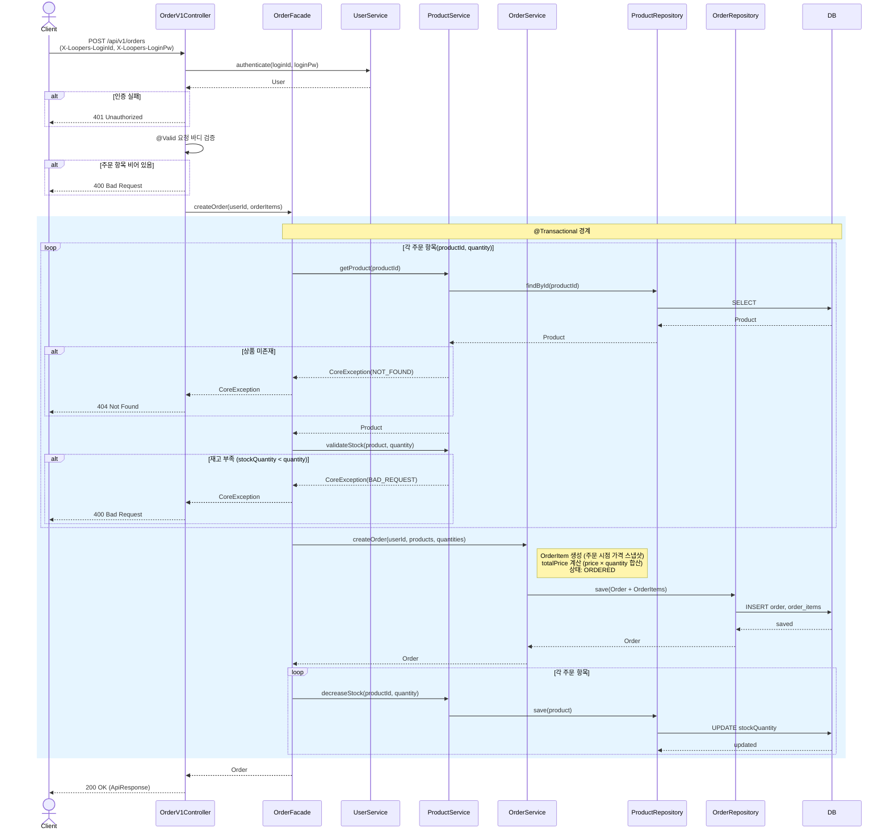
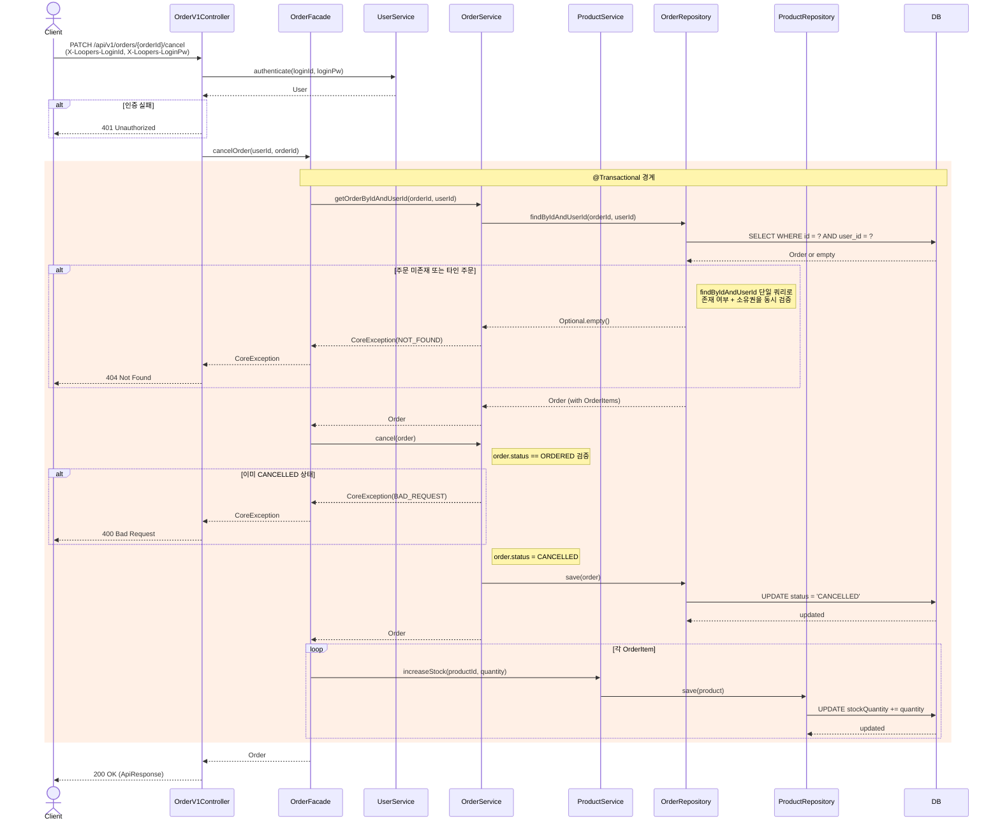
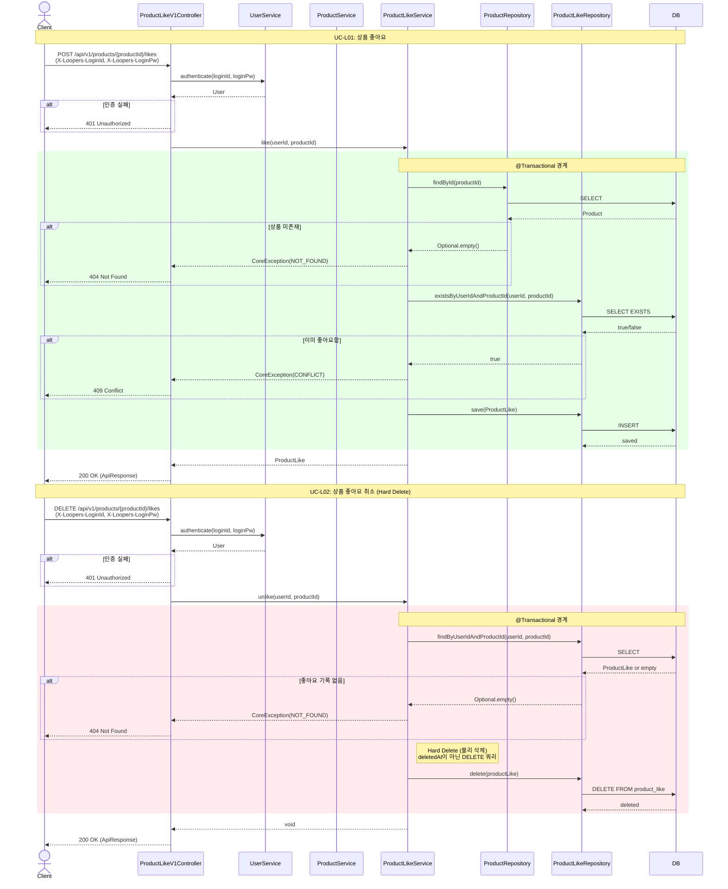
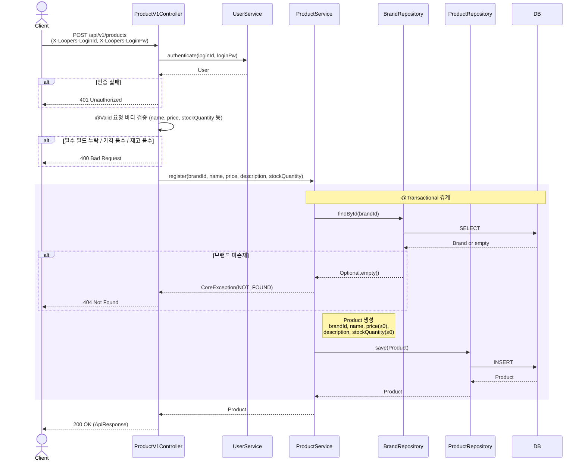

# 02. 시퀀스 다이어그램

> 핵심 API의 호출 흐름을 레이어 단위로 시각화한다.
> 누가 무엇을 책임지는지, 트랜잭션 경계는 어디인지를 표현하는 것이 목적이다.

---

## 목차

1. [주문 생성 (UC-O01)](#1-주문-생성-uc-o01) — 필수
2. [주문 취소 (UC-O04)](#2-주문-취소-uc-o04) — 필수
3. [상품 좋아요 / 취소 (UC-L01, UC-L02)](#3-상품-좋아요--취소-uc-l01-uc-l02) — 선택
4. [상품 등록 (UC-P01)](#4-상품-등록-uc-p01) — 선택

---

## 1. 주문 생성 (UC-O01)

### 이유

주문 생성은 이 시스템에서 가장 복잡한 흐름이다.
여러 도메인(Order, Product)을 하나의 트랜잭션에서 조합해야 하고,
재고 검증 → OrderItem 생성 → 재고 차감이 순서대로 이루어져야 한다.

이 다이어그램으로 확인하려는 것:
- Facade가 OrderService와 ProductService를 어떻게 조합하는가
- 트랜잭션 경계는 어디인가
- 재고 부족 시 흐름이 어디서 끊기는가

### 다이어그램

### 해석

**레이어별 책임**
- **Controller**: 인증 처리, 요청 바디 검증(@Valid), 응답 래핑
- **Facade**: 여러 도메인 서비스(ProductService, OrderService)를 조합하는 유스케이스 오케스트레이터. 트랜잭션의 주체
- **ProductService**: 상품 조회, 재고 검증, 재고 차감. 자기 도메인의 비즈니스 규칙만 책임
- **OrderService**: Order + OrderItem 생성, 가격 스냅샷, totalPrice 계산. 주문 도메인 내 로직만 책임

**트랜잭션 경계**
- `@Transactional`은 Facade 레벨에 설정한다.
- 상품 조회 → 재고 검증 → 주문 저장 → 재고 차감이 하나의 트랜잭션으로 묶인다.
- 중간에 예외가 발생하면 전체 롤백된다 (재고가 차감되지 않은 상태로 복원).

**설계 의도**
- OrderService는 ProductService를 직접 참조하지 않는다. Facade가 둘을 조합한다.
- 재고 차감을 주문 저장 이후에 수행하는 이유: 주문 저장이 실패하면 재고 차감도 불필요하기 때문이다.
- 가격은 주문 시점에 스냅샷한다 (OrderItem.price). 이후 상품 가격이 변경되어도 주문 금액은 불변이다.

**잠재 리스크**
- 트랜잭션 비대화: 상품이 많아질수록 loop 내 DB 호출이 증가한다. 현 최소 구현에서는 허용 가능하나, 대량 주문 시 batch 조회로 개선 가능하다.

---

## 2. 주문 취소 (UC-O04)

### 이유

주문 취소는 상태 전이(ORDERED → CANCELLED)와 재고 복원을 동시에 처리해야 한다.
주문 생성의 역방향 흐름이며, Facade에서 두 도메인을 다시 조합하는 구조를 확인한다.

이 다이어그램으로 확인하려는 것:
- 상태 전이 검증 로직이 어디에 위치하는가
- 타인 주문 접근 시 404를 반환하는 쿼리 전략
- 재고 복원이 트랜잭션 내에서 이루어지는가

### 다이어그램

### 해석

**레이어별 책임**
- **Controller**: 인증, orderId 경로 변수 추출, 응답 래핑
- **Facade**: 주문 조회 → 상태 전이 → 재고 복원을 하나의 트랜잭션으로 조합
- **OrderService**: 본인 주문 조회(`findByIdAndUserId`), 상태 전이 검증 및 변경
- **ProductService**: 재고 복원 (increaseStock)

**타인 주문 접근 정책 (Q-O01 반영)**
- `findByIdAndUserId(orderId, userId)` 단일 쿼리를 사용한다.
- 주문이 존재하지 않거나 타인의 주문이면 동일하게 `404 Not Found`를 반환한다.
- orderId의 존재 여부가 응답으로 노출되지 않는다.

**상태 전이 (Q-O02 반영)**
- ORDERED → CANCELLED만 허용한다.
- 이미 CANCELLED인 주문에 대한 취소 요청은 `400 Bad Request`를 반환한다.
- 상태 전이 검증은 OrderService(도메인 레이어)의 책임이다.

**재고 복원 (Q-O03 반영)**
- 주문 취소 시 각 OrderItem의 quantity만큼 재고를 복원한다.
- 복원은 트랜잭션 내에서 수행되므로, 상태 변경과 재고 복원의 원자성이 보장된다.

**잠재 리스크**
- 주문 생성과 동일하게 OrderItem이 많을수록 loop 내 DB 호출이 증가한다.
- 상태 변경과 재고 복원이 하나의 트랜잭션으로 묶여 트랜잭션이 비대해질 수 있으나, Facade에서 OrderService/ProductService 책임을 분리하여 각 도메인의 독립성은 유지한다.

---

## 3. 상품 좋아요 / 취소 (UC-L01, UC-L02)

### 이유

좋아요/취소는 단일 도메인 흐름이지만, Hard Delete라는 설계 결정(Q-L01)이 반영된 흐름을 명시적으로 확인할 필요가 있다.
두 흐름이 대칭적이므로 하나의 다이어그램에 통합한다.

### 다이어그램

### 해석

**좋아요 등록 흐름**
- 상품 존재 확인 → 중복 좋아요 확인 → 저장 순서로 진행한다.
- 중복 체크는 `existsByUserIdAndProductId`로 수행하며, UNIQUE 제약과 이중 방어된다.

**좋아요 취소 흐름 (Q-L01 반영)**
- Soft Delete(deletedAt)가 아닌 **Hard Delete(물리 삭제)**를 사용한다.
- `delete()` 호출로 DB에서 레코드를 완전히 제거한다.
- 이로 인해 (userId, productId) UNIQUE 제약이 단순하게 유지되고, 재좋아요 시 새로운 INSERT만 하면 된다.

**Facade를 사용하지 않는 이유**
- 좋아요 흐름은 단일 도메인(ProductLike) 범위에서 완결된다.
- 상품 존재 확인은 ProductLikeService가 ProductRepository를 조회하는 것으로 충분하다.
- 여러 도메인 서비스를 조합할 필요가 없으므로 Controller → Service 직접 호출이 적절하다.

---

## 4. 상품 등록 (UC-P01)

### 이유

상품 등록은 Brand 도메인과의 관계(FK 참조)를 포함하며, 향후 주문/좋아요의 전제가 되는 흐름이다.
단순한 구조이지만 Brand 존재 검증이라는 교차 도메인 확인 지점을 명시한다.

### 다이어그램

### 해석

**Brand 존재 검증**
- 상품은 반드시 존재하는 Brand에 소속되어야 한다.
- ProductService가 BrandRepository를 직접 조회하여 검증한다.
- 이 관계는 단방향이다 (Product → Brand 참조, Brand는 Product를 모른다).

**Facade를 사용하지 않는 이유**
- Brand 조회는 FK 참조 검증일 뿐, Brand 도메인의 비즈니스 로직을 호출하는 것이 아니다.
- Repository 조회만으로 충분하므로 Service 레벨에서 처리한다.

**필드 검증 (Q-P01 반영)**
- 가격은 0 이상 허용 (무료 상품 가능).
- 재고 수량도 0 이상 허용 (재고 없는 상품 등록 가능, 조회에 노출됨).

---

## 다이어그램 요약

| 다이어그램 | 핵심 포인트 | 관련 설계 결정 |
|------------|-------------|----------------|
| 주문 생성 | Facade에서 Product+Order 조합, 트랜잭션 내 재고 차감 | Q-P02 (재고 0 노출, 주문 시 검증) |
| 주문 취소 | 상태 전이 ORDERED→CANCELLED, 재고 복원 | Q-O01 (404), Q-O02 (2개 상태), Q-O03 (복원) |
| 좋아요/취소 | Hard Delete, UNIQUE 제약 단순화 | Q-L01 (Hard Delete) |
| 상품 등록 | Brand FK 검증, 가격 0 이상 허용 | Q-P01 (0 이상) |

### 다이어그램에 포함하지 않은 API

| API | 미포함 사유 |
|-----|-------------|
| GET /api/v1/brands, GET /api/v1/brands/{brandId} | 단순 CRUD 조회. Controller → Service → Repository → DB 직선 흐름으로 별도 다이어그램 불필요 |
| GET /api/v1/products, GET /api/v1/products/{productId} | 동일. 재고 0 상품도 그대로 반환 (필터링 없음) |
| GET /api/v1/orders/{orderId}, GET /api/v1/orders/me | 주문 조회는 주문 취소 다이어그램 내 findByIdAndUserId 패턴으로 설명 완료 |
