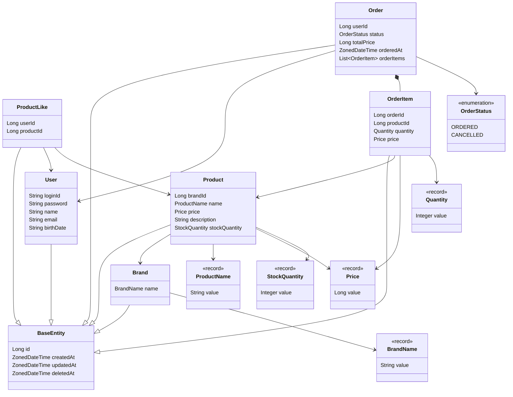
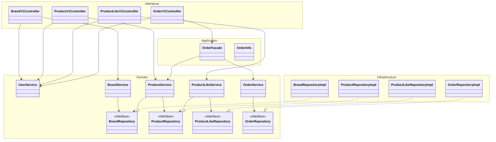

# 03. 클래스 다이어그램

> 도메인 모델의 책임과 관계, 레이어별 클래스 구조를 정의한다.
> base branch: main

---

## 목차

1. [도메인 모델 다이어그램](#1-도메인-모델-다이어그램)
2. [레이어 구조 다이어그램](#2-레이어-구조-다이어그램)
3. [레이어별 클래스 목록](#3-레이어별-클래스-목록)

---

## 1. 도메인 모델 다이어그램

### 이유

도메인 모델 다이어그램은 각 엔티티가 어떤 데이터를 가지고, 엔티티 간 관계가 어떻게 구성되는지를 한눈에 파악하기 위해 필요하다.
특히 Value Object 식별, 연관관계 방향, 도메인 객체의 책임 배치를 확인하는 것이 목적이다.

### 다이어그램



### 해석

**엔티티 6개, Enum 1개, Value Object 5개**

| 클래스 | 분류 | 핵심 책임 |
|--------|------|-----------|
| BaseEntity | 추상 클래스 | id, 타임스탬프 자동 관리, Soft Delete(delete/restore), guard 훅 |
| User | Entity (1주차 참조) | 회원 인증 정보 보유, 비밀번호 변경 |
| Brand | Entity | 브랜드 이름 보유, 이름 유효성 검증(guard) |
| Product | Entity | 상품 정보 보유, **재고 차감/복원 책임** (decreaseStock/increaseStock) |
| ProductLike | Entity (조인) | User-Product 간 좋아요 관계 표현 |
| Order | Entity | **상태 전이 책임(cancel)**, totalPrice 계산, OrderItem 관리 |
| OrderItem | Entity | 주문 시점 가격 스냅샷, 수량 보유 |
| OrderStatus | Enum | ORDERED, CANCELLED 2개 상태 |
| BrandName | Value Object | 브랜드 이름 (1~50자, 공백 불가) |
| ProductName | Value Object | 상품명 (1~100자) |
| Price | Value Object | 가격 (0 이상), Product와 OrderItem에서 공유 |
| StockQuantity | Value Object | 재고 수량 (0 이상) |
| Quantity | Value Object | 주문 수량 (1 이상) |

### 설계 의도

**Value Object — 1주차 패턴을 이어간다**

- 1주차 User 도메인이 `MemberId`, `Email`, `BirthDate` 등을 VO로 정의했듯이, 2주차 도메인도 검증 규칙이 있는 필드를 VO로 추출한다.
- 모든 VO는 `record` 타입으로 정의하고, Compact Constructor에서 검증한다.
- `Price`는 Product와 OrderItem에서 공유한다. 동일한 "0 이상의 금액"이라는 도메인 규칙을 가진다.
- `Quantity`(1 이상)와 `StockQuantity`(0 이상)는 검증 규칙이 다르므로 분리한다.

**VO 검증 규칙**

| Value Object | 타입 | 검증 규칙 |
|-------------|------|-----------|
| BrandName | record(String value) | null/blank 불가, 1~50자 |
| ProductName | record(String value) | null/blank 불가, 1~100자 |
| Price | record(Long value) | null 불가, 0 이상 |
| StockQuantity | record(Integer value) | null 불가, 0 이상 |
| Quantity | record(Integer value) | null 불가, 1 이상 |

**책임 배치 원칙 — 도메인 객체가 자기 규칙을 갖는다**

- **Product.decreaseStock() / increaseStock()**: 재고 변경은 Product 자신의 책임이다. Service가 직접 `stockQuantity` 필드를 조작하지 않고, Product에게 메시지를 보낸다. `decreaseStock()`은 내부에서 재고 부족 여부를 검증한다.
- **Order.cancel()**: 상태 전이 규칙(ORDERED -> CANCELLED)은 Order 내부에 캡슐화한다. 현재 상태가 ORDERED가 아니면 예외를 던진다. Service는 `order.cancel()`을 호출할 뿐, 상태 값을 직접 변경하지 않는다.
- **Order.calculateTotalPrice()**: OrderItem의 price * quantity 합산 로직은 Order가 소유한다. 외부에서 totalPrice를 임의로 설정하지 않는다.

**연관관계 — 단방향만 사용한다**

- 모든 연관관계는 N 쪽에서 1 쪽으로의 단방향이다.
- `Product -> Brand`: Product가 brandId로 Brand를 참조한다. Brand는 Product 목록을 모른다.
- `ProductLike -> User, Product`: ProductLike가 양쪽을 FK로 참조한다. User와 Product는 ProductLike를 모른다.
- `Order -> User`: Order가 userId로 User를 참조한다.
- `OrderItem -> Product`: OrderItem이 productId로 Product를 참조한다.
- **예외: Order *-- OrderItem (composition)**: Order가 OrderItem 리스트를 가진다. 주문 취소 시 OrderItem 목록을 순회하여 재고를 복원해야 하므로, 이 방향의 참조가 필요하다.

**ProductLike — N:M을 조인 엔티티로 풀었다**

- User와 Product 사이의 좋아요 관계는 개념적으로 N:M이다.
- 이를 ProductLike 조인 엔티티로 풀어 (userId, productId) UNIQUE 제약으로 중복을 방지한다.
- Hard Delete 정책(Q-L01)이므로 Soft Delete 관련 필드(deletedAt)는 이 엔티티에서 사용하지 않는다. 다만 BaseEntity를 상속하므로 필드 자체는 존재한다.

**guard() 활용**

- BaseEntity의 `guard()`를 Brand, Product, Order에서 오버라이드하여 `@PrePersist`, `@PreUpdate` 시점에 도메인 규칙을 검증한다.
- 예: Brand.guard()는 name이 비어 있으면 예외, Product.guard()는 price < 0이면 예외, Order.guard()는 status가 null이면 예외.

---

## 2. 레이어 구조 다이어그램

### 이유

레이어 구조 다이어그램은 Interfaces → Application → Domain ← Infrastructure의 의존 방향이 올바르게 지켜지는지, 각 레이어에 어떤 클래스가 위치하는지, Facade가 필요한 도메인과 불필요한 도메인을 구분하기 위해 필요하다.
특히 Service 간 직접 참조 금지 원칙이 지켜지는지, 인증 흐름이 어디서 처리되는지를 확인하는 것이 목적이다.

### 다이어그램



### 해석

**의존 방향은 항상 안쪽을 향한다**

```
Interfaces --> Application --> Domain <-- Infrastructure
```

- Controller는 Facade 또는 Service를 호출한다.
- Facade는 여러 Service를 조합한다.
- Service는 Repository 인터페이스에 의존한다.
- Infrastructure가 Repository 인터페이스를 구현한다 (의존성 역전).

**인증 흐름**

- 인증이 필요한 API에서 Controller가 UserService.authenticate()를 직접 호출한다.
- UserService는 1주차에 구현된 도메인 서비스로, 2주차 도메인에서 참조한다.
- 시퀀스 다이어그램에서 표현된 인증 흐름과 일치시켰다.

**Facade가 필요한 도메인과 불필요한 도메인**

| 도메인 | Facade | 이유 |
|--------|--------|------|
| Order | **OrderFacade 사용** | 주문 생성/취소 시 ProductService + OrderService 조합 필요 |
| Brand | 불필요 | 단일 도메인 완결 |
| Product | 불필요 | Brand FK 검증은 Repository 조회로 충분 |
| ProductLike | 불필요 | 상품 존재 확인은 Repository 조회로 충분 |

**Service 간 직접 참조 금지**

- OrderService는 ProductService를 직접 참조하지 않는다.
- 둘의 조합은 반드시 OrderFacade를 통해서만 이루어진다.
- ProductService가 BrandRepository를 참조하는 것은 FK 검증(존재 확인)이므로 허용한다. Brand의 비즈니스 로직을 호출하는 것이 아니다.
- ProductLikeService가 ProductRepository를 참조하는 것도 동일한 이유로 허용한다.

### 설계 의도

**트랜잭션 경계**

| 클래스 | 메서드 | 트랜잭션 | 이유 |
|--------|--------|----------|------|
| OrderFacade | createOrder() | `@Transactional` | Product 재고 차감 + Order 저장이 원자적이어야 함 |
| OrderFacade | cancelOrder() | `@Transactional` | Order 상태 변경 + Product 재고 복원이 원자적이어야 함 |
| BrandService | register() | `@Transactional` | 단일 도메인 쓰기 |
| BrandService | getBrandById(), getAllBrands() | `@Transactional(readOnly = true)` | 읽기 전용 |
| ProductService | register() | `@Transactional` | 단일 도메인 쓰기 (Brand FK 검증 포함) |
| ProductService | getProductById(), getAllProducts() | `@Transactional(readOnly = true)` | 읽기 전용 |
| ProductService | decreaseStock(), increaseStock() | `@Transactional` | 재고 수정 |
| ProductLikeService | like() | `@Transactional` | 단일 도메인 쓰기 |
| ProductLikeService | unlike() | `@Transactional` | 단일 도메인 삭제 (Hard Delete) |
| OrderService | createOrder() | `@Transactional` | 주문 + OrderItem 저장 |
| OrderService | cancel() | `@Transactional` | 상태 변경 |
| OrderService | getOrderByIdAndUserId(), getOrdersByUserId() | `@Transactional(readOnly = true)` | 읽기 전용 |

**OrderInfo — 애플리케이션 레벨 DTO**

- OrderFacade가 Controller에게 반환하는 데이터를 OrderInfo로 정의한다.
- Order 엔티티의 세부사항을 노출하지 않고, Facade가 필요한 정보만 조합하여 전달한다.

**ProductLikeRepository.delete() — Hard Delete 반영 (Q-L01)**

- Q-L01 결정에 따라 `delete()` 메서드가 Repository 인터페이스에 포함된다.
- Soft Delete(`deletedAt`)가 아닌 물리 삭제이므로, JpaRepository의 `delete()`를 그대로 위임한다.

**OrderRepository.findByIdAndUserId() — 404 정책 반영 (Q-O01)**

- 타인 주문 접근 시 403이 아닌 404를 반환하기 위해, `findByIdAndUserId(orderId, userId)` 단일 쿼리로 존재 여부 + 소유권을 동시 검증한다.
- Optional.empty()가 반환되면 미존재/타인 주문을 구분하지 않고 NOT_FOUND 예외를 던진다.

**다이어그램에 포함하지 않은 클래스**

- `{Domain}V1ApiSpec`: OpenAPI 명세 인터페이스. Controller가 구현하며, Swagger 어노테이션만 포함한다. 의존 관계에 영향을 주지 않으므로 다이어그램에서는 생략하고, 레이어별 클래스 목록에서 명시한다.
- `{Domain}V1Dto`: API 요청/응답 DTO. Controller의 파라미터/반환 타입으로 사용되며, 독립적인 record 클래스이므로 다이어그램에서는 생략한다.
- **JPA Converter**: Value Object ↔ DB 컬럼 변환. Infrastructure 레이어에 위치하며, 레이어별 클래스 목록에서 명시한다.

---

## 3. 레이어별 클래스 목록

### Domain Layer

| 도메인 | 클래스 | 타입 | 책임 |
|--------|--------|------|------|
| Brand | Brand | Entity | 브랜드 이름 보유, guard()로 이름 검증 |
| Brand | BrandName | Value Object | 브랜드 이름 (1~50자, 공백 불가) |
| Brand | BrandService | Service | 등록(중복 검증), 단건/목록 조회 |
| Brand | BrandRepository | Interface | save, findById, findAll, existsByName |
| Product | Product | Entity | 상품 정보 보유, **decreaseStock/increaseStock** |
| Product | ProductName | Value Object | 상품명 (1~100자) |
| Product | Price | Value Object | 가격 (0 이상), Product와 OrderItem에서 공유 |
| Product | StockQuantity | Value Object | 재고 수량 (0 이상) |
| Product | ProductService | Service | 등록(Brand FK 검증), 단건/목록 조회, 재고 차감/복원 위임 |
| Product | ProductRepository | Interface | save, findById, findAll |
| ProductLike | ProductLike | Entity | User-Product 좋아요 관계 (조인 엔티티) |
| ProductLike | ProductLikeService | Service | 좋아요(중복 검증), 취소(**Hard Delete**) |
| ProductLike | ProductLikeRepository | Interface | save, **delete**, find/existsByUserIdAndProductId |
| Order | Order | Entity | 상태 전이(**cancel**), totalPrice 계산, OrderItem 관리 |
| Order | OrderItem | Entity | 주문 시점 가격 스냅샷, 수량 보유 |
| Order | Quantity | Value Object | 주문 수량 (1 이상) |
| Order | OrderStatus | Enum | ORDERED, CANCELLED |
| Order | OrderService | Service | 주문 생성, 본인 주문 조회(findByIdAndUserId), 취소 위임 |
| Order | OrderRepository | Interface | save, findByIdAndUserId, findByUserId |

### Application Layer

| 도메인 | 클래스 | 타입 | 책임 |
|--------|--------|------|------|
| Order | OrderFacade | Facade | 주문 생성(Product+Order 조합), 주문 취소(상태 전이+재고 복원) |
| Order | OrderInfo | Info (record) | Facade → Controller 간 애플리케이션 레벨 DTO |

### Infrastructure Layer

| 도메인 | 클래스 | 타입 | 책임 |
|--------|--------|------|------|
| Brand | BrandRepositoryImpl | RepositoryImpl | BrandRepository 구현, BrandJpaRepository 위임 |
| Brand | BrandJpaRepository | JpaRepository | Spring Data JPA 인터페이스 |
| Brand | BrandNameConverter | JPA Converter | BrandName ↔ VARCHAR 변환 |
| Product | ProductRepositoryImpl | RepositoryImpl | ProductRepository 구현, ProductJpaRepository 위임 |
| Product | ProductJpaRepository | JpaRepository | Spring Data JPA 인터페이스 |
| Product | ProductNameConverter | JPA Converter | ProductName ↔ VARCHAR 변환 |
| Product | PriceConverter | JPA Converter | Price ↔ BIGINT 변환 |
| Product | StockQuantityConverter | JPA Converter | StockQuantity ↔ INT 변환 |
| ProductLike | ProductLikeRepositoryImpl | RepositoryImpl | ProductLikeRepository 구현 (**delete 포함**), ProductLikeJpaRepository 위임 |
| ProductLike | ProductLikeJpaRepository | JpaRepository | Spring Data JPA 인터페이스 |
| Order | OrderRepositoryImpl | RepositoryImpl | OrderRepository 구현, OrderJpaRepository 위임 |
| Order | OrderJpaRepository | JpaRepository | Spring Data JPA 인터페이스 |
| Order | QuantityConverter | JPA Converter | Quantity ↔ INT 변환 |

### Interfaces Layer

| 도메인 | 클래스 | 타입 | 책임 |
|--------|--------|------|------|
| Brand | BrandV1Controller | Controller | REST API 3개 (등록, 단건 조회, 목록 조회) |
| Brand | BrandV1ApiSpec | ApiSpec (interface) | OpenAPI 명세 (Swagger 어노테이션) |
| Brand | BrandV1Dto | DTO (record) | RegisterRequest, BrandResponse |
| Product | ProductV1Controller | Controller | REST API 3개 (등록, 단건 조회, 목록 조회) |
| Product | ProductV1ApiSpec | ApiSpec (interface) | OpenAPI 명세 (Swagger 어노테이션) |
| Product | ProductV1Dto | DTO (record) | RegisterRequest, ProductResponse |
| ProductLike | ProductLikeV1Controller | Controller | REST API 2개 (좋아요, 취소) |
| ProductLike | ProductLikeV1ApiSpec | ApiSpec (interface) | OpenAPI 명세 (Swagger 어노테이션) |
| ProductLike | ProductLikeV1Dto | DTO (record) | LikeResponse |
| Order | OrderV1Controller | Controller | REST API 4개 (생성, 단건 조회, 내 목록, 취소) |
| Order | OrderV1ApiSpec | ApiSpec (interface) | OpenAPI 명세 (Swagger 어노테이션) |
| Order | OrderV1Dto | DTO (record) | CreateOrderRequest, OrderItemRequest, OrderResponse, OrderItemResponse |

### 클래스 총 수

| 레이어 | 수 |
|--------|-----|
| Domain (Entity + Enum) | 7 |
| Domain (Value Object) | 5 |
| Domain (Service) | 4 |
| Domain (Repository Interface) | 4 |
| Application (Facade + Info) | 2 |
| Infrastructure (Impl + Jpa) | 8 |
| Infrastructure (Converter) | 5 |
| Interfaces (Controller + ApiSpec + Dto) | 12 |
| **합계** | **47** |
