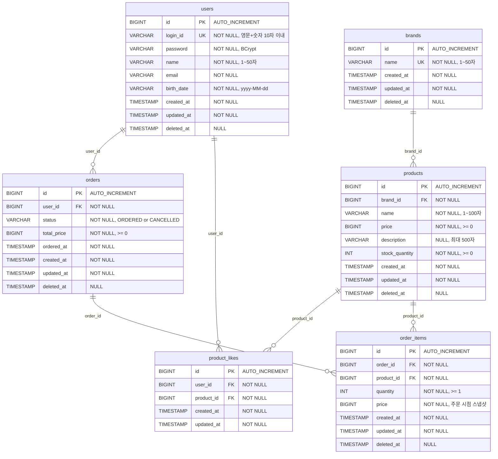

# ERD (Entity-Relationship Diagram)

> JPA 매핑 기준의 물리 테이블 구조를 정의한다.
> base branch: main

---

## 목차

- [ERD 다이어그램](#erd-다이어그램)
- [테이블 상세 명세](#테이블-상세-명세)
- [삭제 정책](#삭제-정책)
- [테이블별 설계 의도](#테이블별-설계-의도)
- [인덱스 전략](#인덱스-전략)
- [트랜잭션 충돌 가능 지점](#트랜잭션-충돌-가능-지점)

---

## ERD 다이어그램

### 이유

ERD는 도메인 모델의 물리적 데이터베이스 구조를 정의하기 위해 필요하다.
클래스 다이어그램의 논리적 모델이 실제 테이블로 어떻게 매핑되는지,
FK 관계와 제약조건이 데이터 정합성을 어떻게 보장하는지를 확인하는 것이 목적이다.

### 다이어그램

### 해석

**테이블 6개, 관계 6개**

- `users` → `orders`, `product_likes`: 회원이 주문을 생성하고 좋아요를 누른다.
- `brands` → `products`: 브랜드가 여러 상품을 가진다.
- `products` → `product_likes`, `order_items`: 상품에 좋아요가 달리고 주문 항목에 포함된다.
- `orders` → `order_items`: 주문이 여러 주문 항목을 가진다.

**핵심 설계 포인트**

- `product_likes`는 Hard Delete 정책(Q-L01)으로 `deleted_at` 컬럼이 없다.
- `order_items.price`는 주문 시점 스냅샷으로, `products.price`와 독립적이다.
- `orders.status`는 Enum을 VARCHAR로 저장한다 (`@Enumerated(EnumType.STRING)`).
- 모든 FK 관계는 단방향이며, N 쪽 테이블에 FK 컬럼이 위치한다.

---

## 테이블 상세 명세

### users (1주차 구현 완료, 참조용)

| 컬럼 | 타입 | 제약조건 | 설명 |
|------|------|----------|------|
| id | BIGINT | PK, AUTO_INCREMENT | |
| login_id | VARCHAR(10) | NOT NULL, UNIQUE | 영문+숫자만 |
| password | VARCHAR(255) | NOT NULL | BCrypt 해시 |
| name | VARCHAR(50) | NOT NULL | |
| email | VARCHAR(255) | NOT NULL | |
| birth_date | VARCHAR(10) | NOT NULL | yyyy-MM-dd |
| created_at | TIMESTAMP | NOT NULL | BaseEntity |
| updated_at | TIMESTAMP | NOT NULL | BaseEntity |
| deleted_at | TIMESTAMP | NULL | BaseEntity, Soft Delete |

### brands

| 컬럼 | 타입 | 제약조건 | 설명 |
|------|------|----------|------|
| id | BIGINT | PK, AUTO_INCREMENT | |
| name | VARCHAR(50) | NOT NULL, UNIQUE | 브랜드 이름 |
| created_at | TIMESTAMP | NOT NULL | BaseEntity |
| updated_at | TIMESTAMP | NOT NULL | BaseEntity |
| deleted_at | TIMESTAMP | NULL | BaseEntity, Soft Delete |

### products

| 컬럼 | 타입 | 제약조건 | 설명 |
|------|------|----------|------|
| id | BIGINT | PK, AUTO_INCREMENT | |
| brand_id | BIGINT | NOT NULL, FK(brands.id) | 소속 브랜드 |
| name | VARCHAR(100) | NOT NULL | 상품명 |
| price | BIGINT | NOT NULL, CHECK(price >= 0) | 판매 가격 (0 허용, Q-P01) |
| description | VARCHAR(500) | NULL | 상품 설명 |
| stock_quantity | INT | NOT NULL, CHECK(stock_quantity >= 0) | 재고 수량 (0 허용, Q-P02) |
| created_at | TIMESTAMP | NOT NULL | BaseEntity |
| updated_at | TIMESTAMP | NOT NULL | BaseEntity |
| deleted_at | TIMESTAMP | NULL | BaseEntity, Soft Delete |

### product_likes

| 컬럼 | 타입 | 제약조건 | 설명 |
|------|------|----------|------|
| id | BIGINT | PK, AUTO_INCREMENT | |
| user_id | BIGINT | NOT NULL, FK(users.id) | 좋아요 누른 회원 |
| product_id | BIGINT | NOT NULL, FK(products.id) | 좋아요 대상 상품 |
| created_at | TIMESTAMP | NOT NULL | BaseEntity |
| updated_at | TIMESTAMP | NOT NULL | BaseEntity |

**UNIQUE 제약**: `UK_product_likes_user_product (user_id, product_id)`

**deleted_at 컬럼 없음**: Hard Delete 정책(Q-L01)이므로 deleted_at을 사용하지 않는다. BaseEntity를 상속하여 필드는 JPA 엔티티에 존재하지만, 비즈니스적으로 사용하지 않으며 DDL에서는 제외할 수 있다.

### orders

| 컬럼 | 타입 | 제약조건 | 설명 |
|------|------|----------|------|
| id | BIGINT | PK, AUTO_INCREMENT | |
| user_id | BIGINT | NOT NULL, FK(users.id) | 주문자 |
| status | VARCHAR(20) | NOT NULL, DEFAULT 'ORDERED' | OrderStatus Enum을 VARCHAR로 저장 |
| total_price | BIGINT | NOT NULL, CHECK(total_price >= 0) | OrderItem 합산 금액 |
| ordered_at | TIMESTAMP | NOT NULL | 주문 시점 |
| created_at | TIMESTAMP | NOT NULL | BaseEntity |
| updated_at | TIMESTAMP | NOT NULL | BaseEntity |
| deleted_at | TIMESTAMP | NULL | BaseEntity, Soft Delete |

**status 컬럼**: OrderStatus Enum은 별도 테이블로 만들지 않고, JPA `@Enumerated(EnumType.STRING)`으로 VARCHAR에 저장한다. 값은 `ORDERED`, `CANCELLED` 2개.

### order_items

| 컬럼 | 타입 | 제약조건 | 설명 |
|------|------|----------|------|
| id | BIGINT | PK, AUTO_INCREMENT | |
| order_id | BIGINT | NOT NULL, FK(orders.id) | 소속 주문 |
| product_id | BIGINT | NOT NULL, FK(products.id) | 주문 상품 |
| quantity | INT | NOT NULL, CHECK(quantity >= 1) | 주문 수량 |
| price | BIGINT | NOT NULL | 주문 시점 상품 가격 (스냅샷) |
| created_at | TIMESTAMP | NOT NULL | BaseEntity |
| updated_at | TIMESTAMP | NOT NULL | BaseEntity |
| deleted_at | TIMESTAMP | NULL | BaseEntity, Soft Delete |

**price 컬럼**: 주문 시점의 상품 가격을 복사해 저장한다. products.price가 이후 변경되어도 주문 금액은 불변이다.

---

## 삭제 정책

| 테이블 | 정책 | deleted_at | 근거 |
|--------|------|------------|------|
| users | Soft Delete | 있음 | 1주차 구현, BaseEntity 기본 패턴 |
| brands | Soft Delete | 있음 | 브랜드 삭제 시 소속 상품 조회에 영향, 이력 보존 |
| products | Soft Delete | 있음 | 삭제된 상품도 기존 주문의 OrderItem에서 참조 가능해야 함 |
| product_likes | **Hard Delete** | **없음** | Q-L01 결정. UNIQUE 제약 단순화, 이력 보존 불필요 |
| orders | Soft Delete | 있음 | 주문 이력 보존 필수 |
| order_items | Soft Delete | 있음 | 주문에 종속, 주문과 동일한 정책 적용 |

---

## 테이블별 설계 의도

### users

- 1주차에 구현 완료된 테이블이다. 2주차 도메인들이 FK로 참조한다.
- login_id에 UNIQUE 제약이 있어 중복 가입을 방지한다.

### brands

- name에 UNIQUE 제약을 걸어 동일 브랜드 이름의 중복 등록을 방지한다.
- products 테이블에서 brand_id FK로 참조한다. Brand가 삭제(Soft Delete)되어도 기존 상품은 유지된다.

### products

- brand_id FK로 brands 테이블을 단방향 참조한다.
- price와 stock_quantity에 CHECK 제약으로 음수를 방지한다.
- stock_quantity는 주문 생성 시 차감, 주문 취소 시 복원된다. 동시성 이슈 가능 지점이다.
- Soft Delete 적용: 삭제된 상품도 기존 order_items.product_id가 참조할 수 있어야 한다.

### product_likes

- User와 Product 간 N:M 관계를 조인 테이블로 풀었다.
- (user_id, product_id) 복합 UNIQUE 제약으로 동일 사용자의 중복 좋아요를 DB 레벨에서 방지한다.
- Hard Delete 정책이므로 취소 시 레코드를 물리 삭제한다. 재좋아요 시 새로운 INSERT만 필요하다.
- deleted_at이 없으므로 UNIQUE 제약에 deletedAt 조건을 결합할 필요가 없다.

### orders

- user_id FK로 users 테이블을 단방향 참조한다.
- status는 Enum을 VARCHAR로 저장한다. 별도 테이블로 분리하지 않는다.
- `findByIdAndUserId(orderId, userId)` 쿼리 패턴을 지원하기 위해 (id, user_id) 복합 인덱스가 필요하다. 이 쿼리는 주문 단건 조회와 주문 취소에서 사용되며, 타인 주문 접근 시 404를 반환하는 정책(Q-O01)을 구현한다.

### order_items

- order_id FK로 orders, product_id FK로 products를 각각 단방향 참조한다.
- price는 주문 시점 상품 가격의 스냅샷이다. products.price와 독립적으로 유지된다.
- quantity는 1 이상이어야 한다. 주문 취소 시 이 값만큼 재고가 복원된다.

---

## 인덱스 전략

### PK 인덱스 (자동 생성)

| 테이블 | 인덱스 | 대상 |
|--------|--------|------|
| users | PK | id |
| brands | PK | id |
| products | PK | id |
| product_likes | PK | id |
| orders | PK | id |
| order_items | PK | id |

### UNIQUE 인덱스

| 테이블 | 인덱스명 | 대상 | 용도 |
|--------|----------|------|------|
| users | UK_users_login_id | login_id | 로그인 ID 중복 방지, 인증 시 조회 |
| brands | UK_brands_name | name | 브랜드 이름 중복 방지 |
| product_likes | UK_product_likes_user_product | (user_id, product_id) | 중복 좋아요 방지, 좋아요 조회/삭제 |

### FK 인덱스

| 테이블 | 인덱스명 | 대상 | 용도 |
|--------|----------|------|------|
| products | IDX_products_brand_id | brand_id | 브랜드별 상품 조회 |
| product_likes | IDX_product_likes_user_id | user_id | 복합 UNIQUE에 포함 |
| product_likes | IDX_product_likes_product_id | product_id | 상품별 좋아요 조회 |
| orders | IDX_orders_user_id | user_id | 내 주문 목록 조회 (findByUserId) |
| order_items | IDX_order_items_order_id | order_id | 주문별 항목 조회 |
| order_items | IDX_order_items_product_id | product_id | 상품별 주문 항목 역추적 |

### 비즈니스 인덱스

| 테이블 | 인덱스명 | 대상 | 용도 |
|--------|----------|------|------|
| orders | IDX_orders_id_user_id | (id, user_id) | findByIdAndUserId 쿼리 최적화 (Q-O01 정책) |
| orders | IDX_orders_status | status | 상태별 주문 필터링 (향후 확장 대비) |

---

## 트랜잭션 충돌 가능 지점

| 지점 | 테이블 | 상황 | 원인 | 대응 |
|------|--------|------|------|------|
| 주문 생성 시 재고 차감 | products | 동일 상품에 대한 동시 주문 | stock_quantity UPDATE 경합 | 현 최소 구현에서는 DB 레벨 row lock으로 처리. 대량 트래픽 시 비관적 락 또는 분산 락 검토 |
| 주문 취소 시 재고 복원 | products | 동일 상품의 재고 차감과 복원이 동시 발생 | stock_quantity UPDATE 경합 | 위와 동일 |
| 좋아요 중복 등록 | product_likes | 동일 사용자가 같은 상품에 동시 좋아요 | UNIQUE 제약 위반 | DB UNIQUE 제약으로 방어. 애플리케이션에서 예외 캐치 후 409 반환 |
| 주문 생성 + 주문 취소 동시 | orders, products | 주문 A 생성(재고 차감) + 주문 B 취소(재고 복원)가 동일 상품에서 동시 발생 | stock_quantity 갱신 순서 | 트랜잭션 격리 수준(READ COMMITTED)으로 처리. lost update는 row lock이 방지 |
| 브랜드 중복 등록 | brands | 동일 이름 브랜드 동시 등록 | UNIQUE 제약 위반 | DB UNIQUE 제약으로 방어. 애플리케이션에서 예외 캐치 후 409 반환 |
